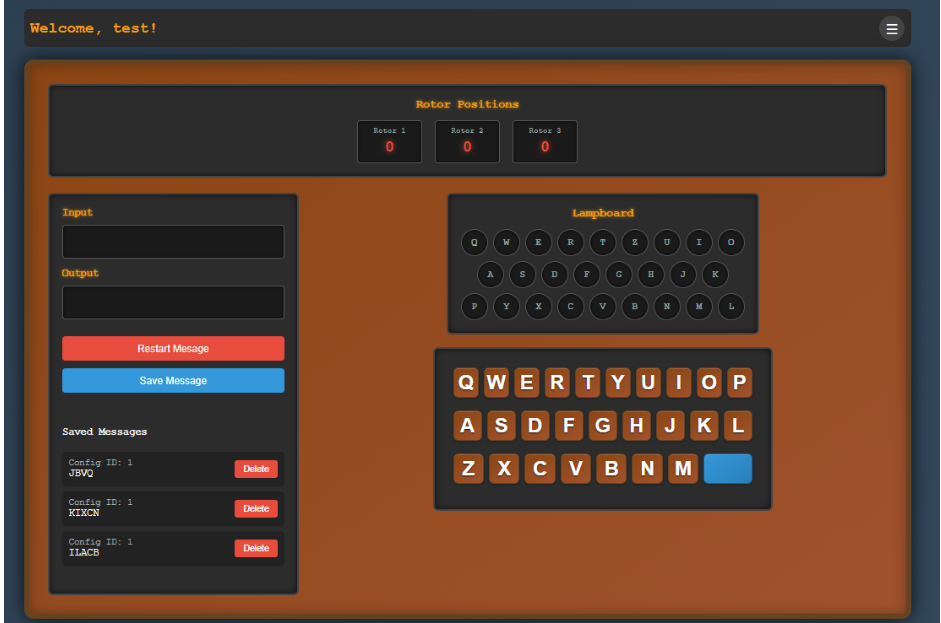
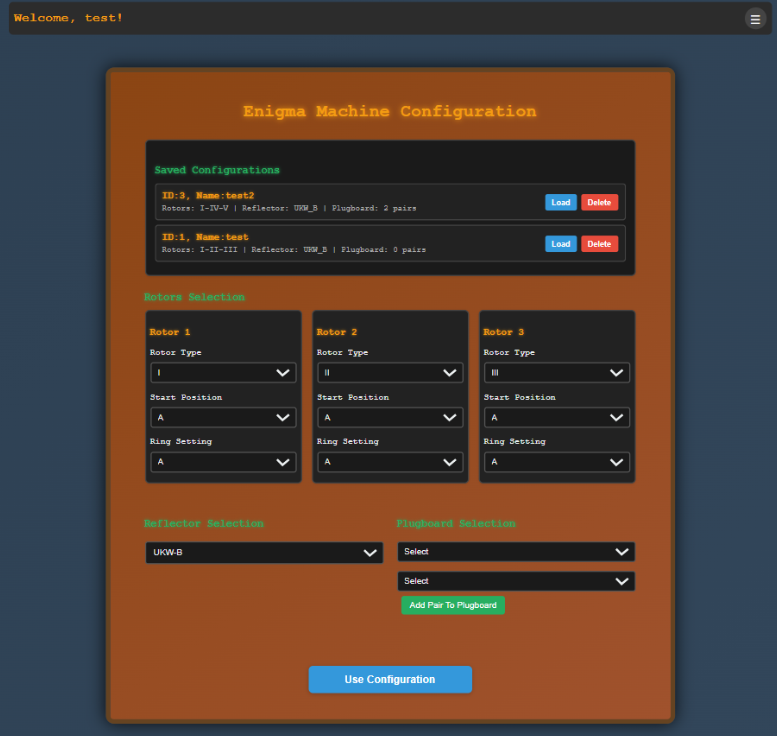

# Online Enigma Machine Emulator

Summer 2025 NAU CS315 Final Project
Developed by Aiden Seay, Victor Rodriguez, and Nasya Valenzuela

## Overview

This repository contains files to run an online enigma machine emulator. Users will be able to encode and decode secret messages accurate to the Enigma M3 series used by the Germans in WWII. This machine's encryption algorithm was broken by Alan Turing and his team at Bletchley Park.


<p align="center" ><em>Main Emulator Page</em></p>


<p align="center" ><em>Configuration Page</em></p>

### Project Components

#### Message Encoding and Decoding

* Interactive user interface that allows users to input text and see their encoded or decoded message

#### Enigma Machine Configuration

* A page that will allow users to customize the machine state to create different encryption settings
* The configuration options include swapping rotors, 3 rotating rotors, and a plugboard
* Each configuration can be saved by the user for later use

#### Visual Encryption Steps

* As each key is pressed on the keyboard, the onscreen keyboard will light up the letter pressed and the letter it is encoded to
* The rotors will rotate realistically with each keypress

#### User Accounts and Saved Posts

* Users can create an account to save their encoded or decoded messages to their profile
* User accounts will have their passwords hashed in the database
* Users can save their favorite configurations

#### Manage Account

* Users can delete their saved messages and configurations
* Users can edit their saved machine configurations - Will not overwrite

## Set up

### Program Requirements

* NodeJS
* PostgreSQL
* React

### Installation Steps

1. Clone the repository

```bash
git clone https://github.com/aidengseay/EnigmaMachine.git
```

2. Create a `secrets.env` file (more information below) inside the server folder

```text
DB_USER={...}
DB_HOST={...}
DB_NAME={...}
DB_PASSWORD={...}
DB_PORT={...}
```

3. Start a Postgres server and make a database called `EnigmaDB` containing three tables and their respective columns below

| Table        | Column Name                   | Data Type    | Constraints                                      |
| ------------ | ----------------------------- | ------------ | ------------------------------------------------ |
| **users**    | user\_id                      | SERIAL       | PRIMARY KEY                                      |
|              | username                      | VARCHAR(50)  | UNIQUE, NOT NULL                                 |
|              | password                      | VARCHAR(255) | NOT NULL                                         |
| **configs**  | config\_id                    | SERIAL       | PRIMARY KEY                                      |
|              | user\_id                      | INTEGER      | REFERENCES users(user\_id) ON DELETE CASCADE     |
|              | name                          | VARCHAR(100) | NOT NULL                                         |
|              | rotator\_one                  | VARCHAR(50)  | NOT NULL                                         |
|              | rotator\_two                  | VARCHAR(50)  | NOT NULL                                         |
|              | rotator\_three                | VARCHAR(50)  | NOT NULL                                         |
|              | rotator\_one\_ring\_setting   | INTEGER      | NOT NULL                                         |
|              | rotator\_two\_ring\_setting   | INTEGER      | NOT NULL                                         |
|              | rotator\_three\_ring\_setting | INTEGER      | NOT NULL                                         |
|              | rotator\_one\_ring\_pos       | INTEGER      | NOT NULL                                         |
|              | rotator\_two\_ring\_pos       | INTEGER      | NOT NULL                                         |
|              | rotator\_three\_ring\_pos     | INTEGER      | NOT NULL                                         |
|              | reflector                     | VARCHAR(50)  | NOT NULL                                         |
|              | plugboard                     | VARCHAR(255) | (nullable)                                       |
| **messages** | message\_id                   | SERIAL       | PRIMARY KEY                                      |
|              | user\_id                      | INTEGER      | REFERENCES users(user\_id) ON DELETE CASCADE     |
|              | config\_id                    | INTEGER      | REFERENCES configs(config\_id) ON DELETE CASCADE |
|              | message\_text                 | TEXT         | NOT NULL                                         |

4. Install NodeJS dependencies in both `.../server` and `.../client` folders

```bash
npm i
```

5. Run the backend server in `.../server` with this command hosted on port 8000

```bash
node server.js
```

6. Run the frontend server in `.../client` with this command hosted on port 3000.

```bash
npm start
```

7. Access locally hosted site at `http://localhost:3000`

## References

### Enigma Machine References

Below are resources used to make an accurate enigma machine emulator

* Based off of an [enigma machine emulator](https://www.101computing.net/enigma-machine-emulator/) for testing
* [Enigma machine documentation](https://www.cryptomuseum.com/crypto/enigma/b/index.htm)
* [Video](https://www.youtube.com/watch?v=ybkkiGtJmkM&ab_channel=JaredOwen) explaining pieces of the enigma machine and how they worked
* [Wiring diagrams](https://www.cryptomuseum.com/crypto/enigma/wiring.htm) for accurate to the original enigma machine
[Technical details](https://www.ciphermachinesandcryptology.com/en/enigmatech.htm) of the enigma machine
* Based off of Aiden Seay's [python implementation](https://github.com/aidengseay/CLIEnigmaMachine) created for this project

### Programming References

* [MDN Web Docs](https://developer.mozilla.org/en-US/) for general web dev documentation
* [React Simple Keyboard](https://www.npmjs.com/package/react-simple-keyboard) used for user input
* [useState](https://www.npmjs.com/package/react-simple-keyboard) documentation
* [useRef](https://react.dev/reference/react/useRef) documentation
* [useEffect](https://react.dev/reference/react/useEffect) documentation
* [Supabase](https://supabase.com/) used as PostgreSQL server
* Supabase general pgAdmin [documentation](https://supabase.com/docs/guides/database/pgadmin)

### Backend Technologies

* [Express.js](https://expressjs.com/) - Web application framework for Node.js
* [PostgreSQL (pg)](https://node-postgres.com/) - PostgreSQL client for Node.js
* [bcrypt](https://www.npmjs.com/package/bcrypt) - Password hashing library
* [dotenv](https://www.npmjs.com/package/dotenv) - Environment variable loader
* [body-parser](https://www.npmjs.com/package/body-parser) - Request body parsing middleware

### Frontend Technologies

* [Axios](https://axios-http.com/) - HTTP client for making API requests
* [React Testing Library](https://testing-library.com/docs/react-testing-library/intro/) - Testing utilities for React
* [Web Vitals](https://web.dev/vitals/) - Performance monitoring library
* [ESLint](https://eslint.org/) - Code linting and formatting
* [React Scripts](https://www.npmjs.com/package/react-scripts) - Build tools and development server

### Historical Context

* [Bletchley Park](https://bletchleypark.org.uk/) - Historical site where Enigma was broken
* [Alan Turing](https://en.wikipedia.org/wiki/Alan_Turing) - Mathematician who led the effort to break Enigma
